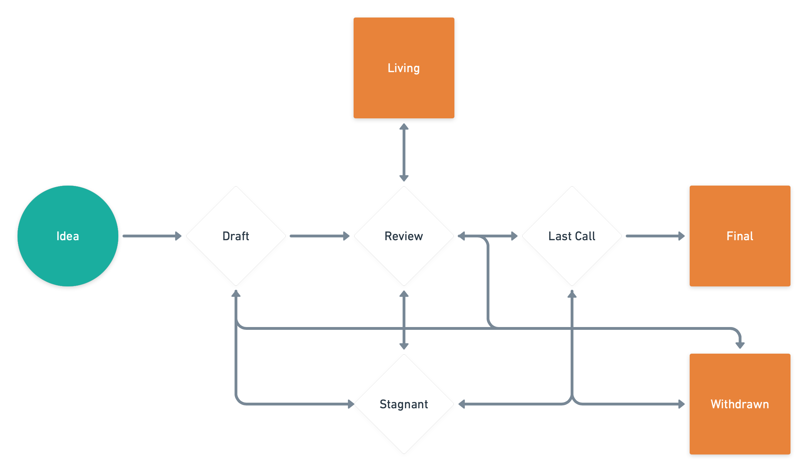

## What is an CIP?

CIP stands for Connext Improvement Proposal. An CIP is a design document providing information to the Connext community, or describing a new feature for COnnext or its processes or environment. The CIP should provide a concise technical specification of the feature and a rationale for the feature. The CIP author is responsible for building consensus within the community and documenting dissenting opinions.

## CIP Rationale

We intend CIPs to be the primary mechanisms for proposing new features, for collecting community technical input on an issue, and for documenting the design decisions that have gone into Connext. Because the CIPs are maintained as text files in a versioned repository, their revision history is the historical record of the feature proposal.

For Connext implementers, CIPs are a convenient way to track the progress of their implementation. Ideally each implementation maintainer would list the CIPs that they have implemented. This will give end users a convenient way to know the current status of a given implementation or library.

## CIP Types

There are three types of CIP:

- A **Standards Track CIP** describes any change that affects most or all Connext implementations, such as—a change to the network protocol, a change in transaction validity rules, proposed application standards/conventions, or any change or addition that affects the interoperability of applications using COnnext. Standards Track CIPs consist of both a design document and an implementation. Furthermore, Standards Track CIPs can be broken down into the following categories:
  - **Core**: improvements requiring a network hard fork, as well as changes that are not necessarily consensus critical but may be relevant to core dev discussions
  - **Networking**: includes improvements around messaging
  - **Interface**: includes improvements around client API specifications and standards, and also certain language-level standards like method names

- A **Meta CIP** describes a process surrounding Connext or proposes a change to (or an event in) a process. Process CIPs are like Standards Track CIPs but apply to areas other than the Connext protocol itself. They may propose an implementation, but not to Connext's codebase; they often require community consensus; unlike Informational CIPs, they are more than recommendations, and users are typically not free to ignore them. Examples include procedures, guidelines, changes to the decision-making process, and changes to the tools or environment used in Connext development. Any meta-CIP is also considered a Process CIP.

- An **Informational CIP** describes a Connext design issue, or provides general guidelines or information to the Connext community, but does not propose a new feature. Informational CIPs do not necessarily represent Connext community consensus or a recommendation, so users and implementers are free to ignore Informational CIPs or follow their advice.

It is highly recommended that a single CIP contain a single key proposal or new idea. The more focused the CIP, the more successful it tends to be. A change to one client doesn't require an CIP; a change that affects multiple clients, or defines a standard for multiple apps to use, does.

An CIP must meet certain minimum criteria. It must be a clear and complete description of the proposed enhancement. The enhancement must represent a net improvement. The proposed implementation, if applicable, must be solid and must not complicate the protocol unduly.

## CIP Work Flow

### Lifecycle

**Idea** - An idea that is pre-draft. This is not tracked within the CIP Repository.

**Draft** - The first formally tracked stage of an CIP in development. An CIP is merged by an CIP Editor into the CIP repository when properly formatted.

**Review** - An CIP Author marks an CIP as ready for and requesting Peer Review.

**Last Call** - This is the final review window for an CIP before moving to `Final`. An CIP editor will assign `Last Call` status and set a review end date (`last-call-deadline`), typically 14 days later.

If this period results in necessary normative changes it will revert the CIP to `Review`.

**Final** - This CIP represents the final standard. A Final CIP exists in a state of finality and should only be updated to correct errata and add non-normative clarifications.

**Stagnant** - Any CIP in `Draft` or `Review` or `Last Call` if inactive for a period of 6 months or greater is moved to `Stagnant`. An CIP may be resurrected from this state by Authors or CIP Editors through moving it back to `Draft` or it's earlier status. If not resurrected, a proposal may stay forever in the this status. 

>*CIP Authors are notified of any algorithmic change to the status of their CIP*

**Withdrawn** - The CIP Author(s) have withdrawn the proposed CIP. This state has finality and can no longer be resurrected using this CIP number. If the idea is pursued at later date it is considered a new proposal.

**Living** - A special status for CIPs that are designed to be continually updated and not reach a state of finality. This includes most notably CIP-1.

### Shepherding an CIP

Parties involved in the process are you, the champion or *CIP author*, the [*CIP editors*](#cip-editors), and the Connext Core Developers.

Before you begin writing a formal CIP, you should vet your idea. Ask the Connext community first if an idea is original to avoid wasting time on something that will be rejected based on prior research. **TODO: Link to connext discourse forum, add discussions-to header**

Once the idea has been vetted, your next responsibility will be to present (by means of an CIP) the idea to the reviewers and all interested parties, invite editors, developers, and the community to give feedback on the aforementioned channels. You should try and gauge whether the interest in your CIP is commensurate with both the work involved in implementing it and how many parties will have to conform to it. For example, the work required for implementing a Core CIP will be much greater than for an Interface and the CIP will need sufficient interest from the Connext client teams. Negative community feedback will be taken into consideration and may prevent your CIP from moving past the Draft stage.

### Core CIPs

For Core CIPs, given that they require client implementations to be considered **Final** (see "CIPs Process" below), you will need to either provide an implementation for clients or convince clients to implement your CIP. 

**TODO: will there be venues to discuss certain Core CIPs similar to the all devs call?**

## What belongs in a successful CIP?

Each CIP should have the following parts:

- Preamble - RFC 822 style headers containing metadata about the CIP, including the CIP number, a short descriptive title (limited to a maximum of 44 characters), a description (limited to a maximum of 140 characters), and the author details. Irrespective of the category, the title and description should not include CIP number. See [below](./cip-1.md#cip-header-preamble) for details.
- Abstract - Abstract is a multi-sentence (short paragraph) technical summary. This should be a very terse and human-readable version of the specification section. Someone should be able to read only the abstract to get the gist of what this specification does.
- Motivation (*optional) - A motivation section is critical for CIPs that want to change the Connext protocol. It should clearly explain why the existing protocol specification is inadequate to address the problem that the CIP solves. CIP submissions without sufficient motivation may be rejected outright.
- Specification - The technical specification should describe the syntax and semantics of any new feature. The specification should be detailed enough to allow competing, interoperable implementations for any of the current Connext platforms.
- Rationale - The rationale fleshes out the specification by describing what motivated the design and why particular design decisions were made. It should describe alternate designs that were considered and related work, e.g. how the feature is supported in other languages. The rationale may also provide evidence of consensus within the community, and should discuss important objections or concerns raised during discussion.
- Backwards Compatibility - All CIPs that introduce backwards incompatibilities must include a section describing these incompatibilities and their severity. The CIP must explain how the author proposes to deal with these incompatibilities. CIP submissions without a sufficient backwards compatibility treatise may be rejected outright.
- Test Cases - Test cases for an implementation are mandatory for CIPs that are affecting consensus changes. Tests should either be inlined in the CIP as data (such as input/expected output pairs, or included in `../assets/cip-###/<filename>`.
- Reference Implementation - An optional section that contains a reference/example implementation that people can use to assist in understanding or implementing this specification.
- Security Considerations - All CIPs must contain a section that discusses the security implications/considerations relevant to the proposed change. Include information that might be important for security discussions, surfaces risks and can be used throughout the life-cycle of the proposal. E.g. include security-relevant design decisions, concerns, important discussions, implementation-specific guidance and pitfalls, an outline of threats and risks and how they are being addressed. CIP submissions missing the "Security Considerations" section will be rejected. An CIP cannot proceed to status "Final" without a Security Considerations discussion deemed sufficient by the reviewers.
- Copyright Waiver - All CIPs must be in the public domain. See the bottom of this CIP for an example copyright waiver.

## CIP Formats and Templates

CIPs should be written in [markdown](https://github.com/adam-p/markdown-here/wiki/Markdown-Cheatsheet) format. There is a [template](https://github.com/connext/cips/blob/main/cip-template.md) to follow.

## CIP Header Preamble

Each CIP must begin with an [RFC 822](https://www.ietf.org/rfc/rfc822.txt) style header preamble, preceded and followed by three hyphens (`---`). This header is also termed ["front matter" by Jekyll](https://jekyllrb.com/docs/front-matter/). The headers must appear in the following order.

` cip:` *CIP number* (this is determined by the CIP editor)

` title:` *The CIP title is a few words, not a complete sentence*

` description:` *Description is one full (short) sentence*

` author:` *The list of the author's or authors' name(s) and/or username(s), or name(s) and email(s). Details are below.*

` status:` *Draft, Review, Last Call, Final, Stagnant, Withdrawn, Living*

` last-call-deadline:` *The date last call period ends on* (Optional field, only needed when status is `Last Call`)

` type:` *One of `Standards Track`, `Meta`, or `Informational`*

` category:` *One of `Core`, `Networking`, or `Interface`* (Optional field, only needed for `Standards Track` CIPs)

` created:` *Date the CIP was created on*

` requires:` *CIP number(s)* (Optional field)

` withdrawal-reason:` *A sentence explaining why the CIP was withdrawn.* (Optional field, only needed when status is `Withdrawn`)

Headers that permit lists must separate elements with commas.

Headers requiring dates will always do so in the format of ISO 8601 (yyyy-mm-dd).

#### `author` header

The `author` header lists the names, email addresses or usernames of the authors/owners of the CIP. Those who prefer anonymity may use a username only, or a first name and a username. The format of the `author` header value must be:

> Random J. User &lt;address@dom.ain&gt;

or

> Random J. User (@username)

if the email address or GitHub username is included, and

> Random J. User

if the email address is not given.

It is not possible to use both an email and a GitHub username at the same time. If important to include both, one could include their name twice, once with the GitHub username, and once with the email.

At least one author must use a GitHub username, in order to get notified on change requests and have the capability to approve or reject them.

#### `type` header

The `type` header specifies the type of CIP: Standards Track, Meta, or Informational. If the track is Standards please include the subcategory (core, networking, or interface).

#### `category` header

The `category` header specifies the CIP's category. This is required for standards-track CIPs only.

#### `created` header

The `created` header records the date that the CIP was assigned a number. Both headers should be in yyyy-mm-dd format, e.g. 2001-08-14.

#### `requires` header

CIPs may have a `requires` header, indicating the CIP numbers that this CIP depends on.

## Linking to other CIPs

References to other CIPs should follow the format `CIP-N` where `N` is the CIP number you are referring to.  Each CIP that is referenced in an CIP **MUST** be accompanied by a relative markdown link the first time it is referenced, and **MAY** be accompanied by a link on subsequent references.  The link **MUST** always be done via relative paths so that the links work in this GitHub repository, forks of this repository, the main CIPs site, mirrors of the main CIP site, etc.  For example, you would link to this CIP with `[CIP-1](./cip-1.md)`.

## Auxiliary Files

Images, diagrams and auxiliary files should be included in a subdirectory of the `assets` folder for that CIP as follows: `assets/cip-N` (where **N** is to be replaced with the CIP number). When linking to an image in the CIP, use relative links such as `../assets/cip-1/image.png`.

## Transferring CIP Ownership

It occasionally becomes necessary to transfer ownership of CIPs to a new champion. In general, we'd like to retain the original author as a co-author of the transferred CIP, but that's really up to the original author. A good reason to transfer ownership is because the original author no longer has the time or interest in updating it or following through with the CIP process, or has fallen off the face of the 'net (i.e. is unreachable or isn't responding to email). A bad reason to transfer ownership is because you don't agree with the direction of the CIP. We try to build consensus around an CIP, but if that's not possible, you can always submit a competing CIP.

If you are interested in assuming ownership of an CIP, send a message asking to take over, addressed to both the original author and the CIP editor. If the original author doesn't respond to the email in a timely manner, the CIP editor will make a unilateral decision (it's not like such decisions can't be reversed :)).

## CIP Editors

The current CIP editors are

- Layne Haber (@LayneHaber)
- Rahul Sethuram (@rhlsthrm)
- Arjun Bhuptani (@ArjunBhuptani)

## CIP Editor Responsibilities

For each new CIP that comes in, an editor does the following:

- Read the CIP to check if it is ready: sound and complete. The ideas must make technical sense, even if they don't seem likely to get to final status.
- The title should accurately describe the content.
- Check the CIP for language (spelling, grammar, sentence structure, etc.), markup (GitHub flavored Markdown), code style

If the CIP isn't ready, the editor will send it back to the author for revision, with specific instructions.

Once the CIP is ready for the repository, the CIP editor will:

- Assign an CIP number (generally the PR number or, if preferred by the author, the Issue # if there was discussion in [the Issues section of this repository](https://github.com/connext/cips/issues) about this CIP)

- Merge the corresponding [pull request](https://github.com/connext/cips/pulls)

- Send a message back to the CIP author with the next step.

Many CIPs are written and maintained by developers with write access to the Connext codebase. The CIP editors monitor CIP changes, and correct any structure, grammar, spelling, or markup mistakes we see.

The editors don't pass judgment on CIPs. We merely do the administrative & editorial part.

## Style Guide

### CIP numbers

When referring to an CIP by number, it should be written in the hyphenated form `CIP-X` where `X` is the CIP's assigned number.

### RFC 2119

CIPs are encouraged to follow [RFC 2119](https://www.ietf.org/rfc/rfc2119.txt) for terminology and to insert the following at the beginning of the Specification section:

> The key words “MUST”, “MUST NOT”, “REQUIRED”, “SHALL”, “SHALL NOT”, “SHOULD”, “SHOULD NOT”, “RECOMMENDED”, “MAY”, and “OPTIONAL” in this document are to be interpreted as described in RFC 2119.

## History

This document was derived heavily from [Ethereum's CIP-1](https://github.com/ethereum/CIPs/blob/master/CIPS/eip-1.md). In many places text was simply copied and modified. Please direct all comments to the CIP editors.

## Copyright

Copyright and related rights waived via [CC0](https://creativecommons.org/publicdomain/zero/1.0/).